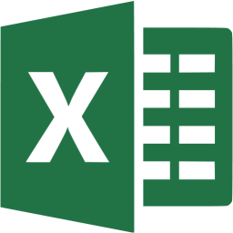

<!-- Links -->
[proposal-doc-link]: <resources/files/proposalDoc.pdf>
[design-doc-link]: <resources/files/designDoc.pdf>
[user-guide-link]: <resources/files/userGuide.pdf>
[test-doc-link]: <resources/files/testDoc.pdf>
[database-links-link]: <resources/files/databaseLinks.pdf>

<!-- Page{0} Front -->

# Support Tracker

Software Development Work-Based Project

<!-- 
Script: 
 - Wait for start
 - Don't say anything, just wait for a few seconds for them to read
 - Move to next slide
 -->

---

<!-- Slides[0.1] Greetings -->
<!-- class: invert -->

## Welcome to my presentation

<!-- 
Script: 
 - Say "Hello"
 - Welcome everyone to the presentation
 - Move to next slide
 -->

---

<!-- Slides[0.2] Who am I? -->

<!-- 
Script: 
 - Introduce the introduction...
 - Ask "Who am I?"
 - Move to next slide
 -->

---

<!-- Slides[1] Me, Myself, Irene? -->
<!--  -->

<!-- class: invert -->

## Shaun Broomfield

### Software Engineer

<i class="fa-brands fa-linkedin"></i> [ShaunBroomfield](https://www.linkedin.com/in/shaunbroomfield)

<i class="fas fa-globe"></i> [shaunbroomfield.com](https://shaunbroomfield.com/)

<i class="fa-brands fa-github"></i> [Broomfields](https://github.com/Broomfields)

<!-- 
Script: 
 - Introduce myself
 - Move to next slide
 -->

---

<!-- Slides[1.1} Who do I work for?  -->

<!-- 
Script: 
 - Ask the question...
 - Wait a second
 - Move to next slide
 -->

---

<!-- Slides[2] Tascomp -->

<!-- _header: "" -->

<!-- ## Tascomp Limited -->

Tascomp are the developers of the Prodigy HMI SCADA software package for industrial monitoring, control, and automation.

Since our establishment in 1981, we have been committed to delivering and improving upon industrial automation and monitoring in a wide range of fields.

### Products

  

  

  

  

  

  

  

  

  

<!-- 
Script: 
 - Introduce Tascomp
 - Provide a general overview
 - Move to next slide
 -->

---

<!-- Slides[2.1} What do we create?  -->

<!-- 
Script: 
 - Ask the question...
 - Wait a second
 - Move to next slide
 -->

---

<!-- Slides[2.2] Prodigy -->

## Prodigy

Prodigy stands as a leading industrial automation software, widely adopted across diverse sectors worldwide.

Rooted in 40 years of systems integration experience, it excels in extracting vital data and transforming it into actionable insights, ensuring seamless and efficient operations.

Its unmatched versatility and comprehensive feature set enable users to address complex automation challenges without requiring additional customisations.

<!-- 
Script: 
 - Provide an overview on Prodigy:
 - > What is it?
 - > What is its purpose?
 - > What is its composition?
 - Move to next slide
 -->

---

<!-- Slides[2.3] PlantRun -->

## PlantRun

Emerging from the robust framework of Prodigy, PlantRun refines the essence of Shop Floor Data Collection, mastering the art of automating real-time data collection and channelling it into actionable intelligence.

Beyond mere enhancement, it represents a paradigm shift in productivity and operational efficiency, all while championing lean manufacturing.

Merging intuitive design with sophisticated analytics, PlantRun delineates the future trajectory of evolved manufacturing.

<!-- 
Script: 
 - Provide an overview on PlantRun:
 - > What is it?
 - > What is its purpose?
 - > What is its composition?
 - Move to next slide
 -->

---

<!-- Slides[2.4] PAMS -->

## PAMS

PAMS, birthed in 2003, is the adaptive evolution of the Prodigy product, purpose-built for precise alarm management in airport ground systems, notably ATC and CNS.

Its vast deployment throughout the UK's civil and military landscapes underscores its proficiency, as it harmoniously melds an intuitive touchscreen interface with a decisive move away from archaic manual alarm techniques.

<!-- 
Script: 
 - Provide an overview on PAMS:
 - > What is it?
 - > What is its purpose?
 - > What is its composition?
 - Move to next slide
 -->

---

<!-- Slides[2.5} What is my Project?  -->

<!-- 
Script: 
 - Ask the question...
 - Wait a second
 - Move to next slide
 -->

---

<!-- Slides[3] Support Tracker -->

<!-- class: lead -->
<!-- _header: "" -->

Tascomp’s answer to the growing demand for a specialised and efficient
internal support ticketing solution.

<!-- 
Script: 
 - Introduce the project by name "Support Tracker"
 - Wait a second
 - State that it is a ticketing system.
 - Move to next slide
 -->

---

<!-- Slides[3.1] Project Introduction -->

## Introduction

Support Tracker will be an internal tool used by Tascomp to effectively manage and track customer inquiries, technical issues, and support requests. The overarching aim is to streamline communication, thus expediting the resolution time for reported issues.

Initiated in July 2023, the project is a graded ICA to be performed as a work-project at Tascomp and to be graded as part of the Software Engineer Degree-Apprenticeship course at Teesside University.

<!-- 
Script: 
 - Read aloud the description
 - Wait a second
 - Move to next slide
 -->

---

<!-- Slides[3.2] Project Value -->

## Project Value

The project holds significant value to Tascomp as it will significantly enhance our existing support processes, benefitting both Tascomp and its customers.

With a key revenue stream coming from support contracts with users of our Prodigy, PlantRun, and PAMS systems, it is imperative that we provide an efficient, user-friendly system for handling support issues.

Moreover, some of our clients, especially those affiliated with government agencies, necessitate distinct support ticket IDs, further emphasizing the importance of this project.

<!-- 
Script: 
 - Read aloud the description:
    The project holds significant value to Tascomp as it will significantly enhance our existing support processes, benefitting both Tascomp and its customers.

    With a key revenue stream coming from support contracts with users of our Prodigy, PlantRun, and PAMS systems, it is imperative that we provide an efficient, user-friendly system for handling support issues.

    Moreover, some of our clients, especially those affiliated with government agencies, necessitate distinct support ticket IDs, further emphasizing the importance of this project.

 - Wait a second
 - Move to next slide
 -->

---

<!-- Slides[3.3] Reason for Development -->

## Reason for Development

The primary motivation for developing Support Tracker is to overcome the limitations of our current system, which was not initially designed for logging and tracking support events and interactions, thus rendering it unwieldy when used as a ticketing system.

Its design was primarily for managing other operational aspects of support contracts, and therefore lacks efficiency and ease-of-use when deployed as a ticketing system. This project was hence initiated to create a new, dedicated ticketing system, specifically designed to handle customer inquiries, technical issues, and support requests effectively and efficiently.

<!-- 
Script: 
 - Read aloud the description:
    The primary motivation for developing Support Tracker is to overcome the limitations of our current system, which was not initially designed for logging and tracking support events and interactions, thus rendering it unwieldy when used as a ticketing system.

Its design was primarily for managing other operational aspects of support contracts, and therefore lacks efficiency and ease-of-use when deployed as a ticketing system. This project was hence initiated to create a new, dedicated ticketing system, specifically designed to handle customer inquiries, technical issues, and support requests effectively and efficiently.

 - Wait a second
 - Move to next slide
-->
  
---

<!-- Slides[3.4] Stakeholders -->

## Stakeholders

 | Stakeholders           | Stake                                                                                                                                                                                                                                                                                                                                                                                                                                                                                                                                       |
 | ---------------------- | ------------------------------------------------------------------------------------------------------------------------------------------------------------------------------------------------------------------------------------------------------------------------------------------------------------------------------------------------------------------------------------------------------------------------------------------------------------------------------------------------------------------------------------------- |
 | Senior Leadership Team | - Increased operational efficiency by reducing support ticket resolution time. - Improved cost-effectiveness through optimized resource allocation. - Enhanced decision-making based on real-time data and analytics. - Ability to meet additional certifications and industry standards due to the enhanced auditing processes facilitated by the streamlined support ticketing system. - Access to a wider range of higher quality and profitable contracts as a result of improved compliance and traceability.              |
 | Applications Team      | - Decreased response time for resolving software-related issues. - Streamlined communication channels for efficient collaboration and knowledge sharing. - Improved productivity by reducing the time spent on manual ticket management tasks.                                                                                                                                                                                                                                                                                        |
 | Software Team          | - Decreased response time for resolving software-related issues. - Streamlined communication channels for efficient collaboration and knowledge sharing. - Improved productivity by reducing the time spent on manual ticket management tasks.                                                                                                                                                                                                                                                                                        |
 | Hardware Team          | - Reduced downtime by quickly identifying and resolving hardware-related issues. - Streamlined coordination with other teams for faster problem resolution. - Improved resource utilization through better tracking and prioritization of hardware support requests. - Simplified and standardised Return Merchandise Authorization (RMA) process through the provision of Ticket or Ticket Event GUIDs. - Enhanced customer satisfaction by offering a seamless RMA experience for those that require it in their own systems. |
 | Supported Customers    | - Faster response and resolution times for their support tickets. - Enhanced customer experience through improved communication and transparency. - Increased satisfaction due to a streamlined and efficient support process. - Integration capability with their internal systems by logging and tracking support events using the provided Ticket and Event GUIDs as a form of RMA.                                                                                                                                             |

<!-- 
Script: 
 - Explain who the stakeholders are
 - Wait a second
 - Move to next slide
-->
  
---

<!-- Slides[3.5] Quantitative Incentives -->

## Quantitative Incentives

 | Incentive                      | Reasoning                                                                                                                                                                                                                                                                                                                               |
 | ------------------------------ | --------------------------------------------------------------------------------------------------------------------------------------------------------------------------------------------------------------------------------------------------------------------------------------------------------------------------------------- |
 | Enhanced Efficiency            | The new streamlined internal support ticketing system will significantly improve operational efficiency by reducing response times and minimising manual processes, leading to increased productivity and time savings for the senior leadership team.                                                                                  |
 | Cost Savings                   | The implementation of the new system will result in cost savings by reducing the need for dedicated support staff, streamlining workflows, and minimizing errors. These savings can be reinvested in other areas of the company or allocated to strategic initiatives.                                                                  |
 | Data-Driven Insights           | The system generates valuable data and metrics on support tickets, allowing senior leadership to identify trends, areas for improvement, and potential training needs. This data-driven approach enables informed decision-making and more effective resource allocation.                                                               |
 | Risk Mitigation                | By implementing a centralised support ticketing system, the company can reduce the risk of lost or misplaced tickets, ensuring that no customer requests or critical issues fall through the cracks. This mitigates potential reputational risks and customer dissatisfaction.                                                          |
 | Enhanced Customer Experience   | The efficient handling of support tickets will result in faster issue resolution for customers, leading to increased customer satisfaction and loyalty. This positive customer experience can have a direct impact on the company’s reputation and bottom line.                                                                         |
 | Compliance and Accountability  | The streamlined system will enable better tracking and monitoring of support ticket status, ensuring accountability and compliance with service level agreements (SLAs) and other performance metrics. This will help the senior leadership team in maintaining high standards of customer service and meeting regulatory requirements. |
 | Improved Decision Making       | The system’s potential for comprehensive reporting and analytics capabilities will provide all teams with different sets of historical and real-time data and insights on support ticket trends, allowing for informed decision making and proactive problem-solving.                                                                   |
 | Enhanced Auditing Capabilities | The incorporation of robust auditing features within the ticketing system will enable the organization to meet new certifications, standards, and compliance, enhancing its ability to bid for more advantageous contracts with customers that require such things.                                                                     |

<!-- 
Script: 
 - Explain the incentives
 - Wait a second
 - Move to next slide
-->
  
---

<!-- Slides[3.6] Deliverables -->

## Deliverables

- Back-End
  - An Microsoft SQL Server Database to store support tickets.
  - Reading from external internal-tool databases to connect with internal tools.
- Front-End
  - A method of `viewing/filtering/sorting` a list of all tickets.
  - A method of `viewing/creating/editing/removing` an individual ticket and its events.
  - A method of `viewing/creating/editing/removing` an individual ticket's event.

<!-- 
Script: 
 - List the deliverables
 - Wait a second
 - Move to next slide
-->
  
---

<!-- Slides[3.7] Consideration of Costing -->

## Consideration of Costing

| Consideration Category   | Specific Items & Descriptions                                                                                             |
| ------------------------ | ------------------------------------------------------------------------------------------------------------------------- |
| Labour Costs             | - Developer salary - Managerial oversight & meetings - Quality assurance                                            |
| Infrastructure Costs     | - Hosting on an internal Windows server - Office space & utilities                                                     |
| Software Licences        | - Development tools & platforms (including annual Microsoft partners program fee) - Other third-party libraries & APIs |
| Training & Documentation | - Demonstration meeting for user training - Design Document, User Guide, Acceptance Testing Document                   |
| Maintenance & Support    | - Bug fixes - Ongoing enhancements - User support                                                                   |
| Contingency Funds        | - Unforeseen challenges & scope changes                                                                                   |

> *Note: Actual costs will vary based on specifics of the system and project requirements.*

<!-- 
Script: 
 - Mention stuff to consider
 - Wait a second
 - Move to next slide
-->
  
---

<!-- Slides[3.8] Management -->

## Project Management

For software development, project management exists in a limited capacity.
Currently it is almost entirely performed through weekly software meetings and the use of an internal tool named Mantis.

These meetings serve as a platform for the software team to discuss and evaluate the status of the previous week's deliverables.

Once evaluated, developers propose tasks for the upcoming week, informing their colleagues and the product owner about their intended tasks. For each prospective task, the importance, priority, and necessity are discussed and negotiated.

Although not explicitly defined as such, these meetings bear a resemblance to the sprint-scrum style of agile development, contributing to an agile-like methodology for our project.

<!-- 
Script: 
 - Tell them about the management process
 - Wait a second
 - Move to next slide
 -->

---

<!-- Slides[3.9] Proposal Reference -->

## Proposal Reference

For a more comprehensive understanding of the project and the justifications for its development, please refer to the Proposal document:

[ Project Proposal Document][proposal-doc-link]

<!-- [ Project Design Document][design-doc-link] -->

<!-- 
Script: 
 - Tell them about the document
 - Wait a second
 - Move to next slide
 -->

---

<!-- Slides[4.0} Development Process  -->

<!-- 
Script: 
 - Wait a second
 - Move to next slide
 -->

---

<!-- Slides[4.1} Development Methodology  -->

## Development Methodology

Our team uses... I don't really know what Development Methodology we use... Its kind of a mix of a bunch of things, mostly traditional, but the programming section of the development process is gaining more and more agile aspects as time goes on.

Here's a simplified overview of our process in phases:

- Design
- Development
- Testing
- Deployment
- Maintenance

---

<!-- Slides[4.2} Development Methodology  -->

## Development Process Flow

  

  

  

  

  

  

  

  

  

<!-- 
Script: 
 - Wait a second
 - Move to next slide
 -->

---

<!-- Slides[4.3} Development Methodology  -->

## Mantis

  

  As seen in the development process flow-chart, every new code addition, be it a new or existing project, requires a Mantis entry.

  Mantis is an internal tool developed and utilised by the company to track all code development, speficially tracking code changes against Prodigy builds.

  

  

  

  

  
  

  

  

  

  

  

  

  

  

  

  

<!-- 
Script: 
 - Explain what Mantis is
 - Move to next slide
 -->

---

<!-- Slides[4.4] Design Document Reference -->

## Design Document

For every new code project, a design document is created and approved.

The following design document provides a detailed and comprehensive understanding of the project and its design:

[ Support Tracker Design Document][design-doc-link]

<!-- 
Script: 
 - Tell them about the document
 - Wait a second
 - Move to next slide
 -->

---

<!-- Slides[5.0} Technology Stack  -->

<!-- 
Script: 
 - Wait a second
 - Move to next slide
 -->

---

<!-- Slides[5.1] Development Platform -->

## Development Platform

ToDo

<!-- 
Script: 
 - Tell them about the development platform.
 - Wait a second
 - Move to next slide
 -->

---

<!-- Slides[5.2] Languages and Frameworks -->

## Languages and Frameworks

ToDo

<!-- 
Script: 
 - Tell them about the codebase.
 - Wait a second
 - Move to next slide
 -->

---

<!-- Slides[5.3] Source Control -->

## Source Control

ToDo

<!-- 
Script: 
 - Tell them about the source control.
 - Wait a second
 - Move to next slide
 -->

---

<!-- Slides[5.4] Databases -->

## Databases

ToDo

<!-- 
Script: 
 - Tell them about the databases.
 - Wait a second
 - Move to next slide
 -->

---

<!-- Slides[5.5] Development Enviroments -->

## Development Enviroments

ToDo

<!-- 
Script: 
 - Tell them about the development enviroments.
 - Wait a second
 - Move to next slide
 -->

---

<!-- Slides[6} Testing  -->

<!-- 
Script: 
 - Wait a second
 - Move to next slide
 -->

---

<!-- Slides[6.1] Project Testing -->

## Project Testing

There are three types of testing to be covered in this project.

Testing Type         | Description                                                          | Implementation
---------------------|----------------------------------------------------------------------|---------------
Acceptance Testing   | Ensures the solution meets business requirements and is fit for purpose. | Performed through user scenarios and use cases to verify that the system fulfils its intended requirements.
Integration Testing  | Evaluates how different components or modules interact and operate together. | Conducted by combining individual units of the software and testing them as a group, ensuring that integrated units function as expected.
Unit Testing         | Focuses on individual parts (or units) of the software to ascertain they function correctly. | Utilises automated test cases written by the developer to test individual functions or methods within the application.

<!-- 
Script: 
 - Tell them about the project testing.
 - Wait a second
 - Move to next slide
 -->

---

<!-- Slides[6.2] Testing Document Reference -->

## Acceptance Testing Document

For every new code project, a test document is created and approved.

The following test document provides a set of user scenarios and user stories for each view in the front-end component of the application, allowing the user-interface to be formally and comprehensively tested:

[ Support Tracker Test Document][test-doc-link]

<!-- 
Script: 
 - Tell them about the test document.
 - Wait a second
 - Move to next slide
 -->

---

<!-- Slides[6.3] Further testing through Unit Tests -->

## Further testing through Unit Tests

  

  Although testing through code has yet to become standard practice at Tascomp,
  Support Tracker contains a variety of unit tests that perform various integration level and unit level tests through code.

   

  

  

  

  Here is minimal example of what this looks like in code:

  

  

<!-- 
Script: 
 - Tell them about the the unit test example.
 - Wait a second
 - Move to next slide
 -->

---

<!-- Slides[7} Deployment  -->

<!-- 
Script: 
 - Wait a second
 - Move to next slide
 -->

---

<!-- Slides[8} User Guide-->

<!-- 
Script: 
 - Wait a second
 - Move to next slide
 -->

---

<!-- Slides[9} Design  -->

<!-- 
Script: 
 - Wait a second
 - Move to next slide
 -->

---

<!-- Slides[x} Architecture  -->

<!-- 
Script: 
 - Wait a second
 - Move to next slide
 -->

---